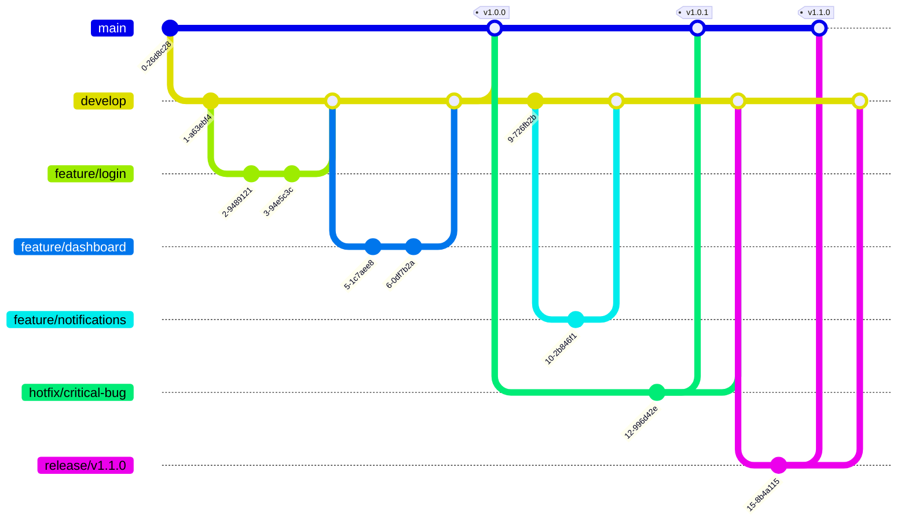

# React Boilerplate

## Introduction

This template provides a complete setup for React using Vite (with SWC) and TypeScript. It is designed to help you quickly start a new React project with a modern, scalable structure and best practices.

### System Requirements
- Node: >= 18.16.0
- NPM or Yarn

### Core Technology Versions
- React: v18.2.0
- Vite: 5.0.8
- TypeScript: 5.2.2

## Installation and Running the Project

### Installing Dependencies

Use [npm](https://www.npmjs.com/) to install packages:

```bash
npm install

# Set up Husky for development environment
./node_modules/.bin/husky install
```

### Running the Project in Development Mode

```bash
npm run dev
```

The application will run at: http://localhost:3000

### Building the Project for Production

```bash
npm run build
```

Build results will be saved in the `dist/` directory.

### Running the Project in Production Mode (after building)

```bash
npm run preview
```

### Checking and Fixing Coding Conventions

```bash
# Check ESLint errors
npm run lint

# Automatically fix ESLint errors
npm run lint:fix

# Check Prettier errors
npm run prettier

# Automatically fix Prettier errors
npm run prettier:fix
```

## Technologies Used

### Core
- **React 18**: Modern UI library with hooks and concurrent features.
- **Vite + SWC**: Fast build tool with SWC for fast TypeScript/JS compilation.
- **TypeScript**: Static typing for safer, more maintainable code.

### State and Data Management
- **React Query**: Server-state management, data fetching, caching, and updating.

### Routing
- **React Router Dom**: Standard routing library for React, supporting dynamic and nested routes.

### Forms and Validation
- **React Hook Form**: Efficient form management with minimal re-renders.
- **Yup**: Schema validation, integrates with React Hook Form.

### Internationalization
- **React i18next**: Internationalization (i18n) solution for React.

### Styling
- **TailwindCSS**: Utility-first CSS framework for rapid UI development.

### Development Tools
- **ESLint**: Linting for JavaScript/TypeScript.
- **Prettier**: Code formatter for consistent style.
- **Husky**: Git hooks manager for pre-commit/push checks.
- **Commitlint**: Enforces commit message conventions.

## Code Conventions

### 1. Naming Conventions
- **Variables/Functions:** Use `camelCase`.
  ```js
  const userName = 'Tom';
  function getUserInfo() { ... }
  ```
- **Components:** Use `PascalCase`.
  ```jsx
  function UserProfile() { ... }
  export default UserProfile;
  ```
- **Files/Folders:**
  - Components: `PascalCase` (e.g., `UserCard.tsx`)
  - Others: `camelCase` or `kebab-case` (e.g., `auth.api.ts`, `user-list.ts`)
- **Constants/Enums:** Use `UPPER_SNAKE_CASE`.
  ```js
  const API_URL = '...';
  enum UserRole { ADMIN, USER }
  ```

### 2. Code Style & Structure
- **Formatting:** Always use Prettier for formatting. Indent with 2 spaces.
- **Imports:**
  - Group: external libs, then internal modules, then styles/assets.
  - Use absolute imports if configured, otherwise use relative imports.
- **Destructuring:** Prefer destructuring for props, state, and objects.
  ```js
  // Good
  const { name, age } = user;
  // Bad
  const name = user.name;
  const age = user.age;
  ```
- **Arrow Functions:** Use arrow functions for callbacks and functional components when possible.
  ```js
  const handleClick = () => { ... };
  ```
- **Component Structure:**
  - Use function components with hooks.
  - Place hooks at the top, then render logic, then return JSX.
  - Type all props and state with TypeScript.
  ```tsx
  type Props = { title: string };
  const Card: React.FC<Props> = ({ title }) => {
    // hooks
    // logic
    return <div>{title}</div>;
  };
  ```

### 3. Comments
- Only comment on complex or non-obvious logic.
- Use English for all comments.
- Do **not** comment obvious code.
  ```js
  // Good
  // Calculate the user's age from their birthdate
  const age = getAge(birthdate);
  // Bad
  // Set age variable
  const age = 18;
  ```

### 4. Clean Code & Forbidden Practices
- **Remove** all unused code, test code, and debug statements before commit.
- **Do not** leave `console.log`, `debugger`, or commented-out code in production.
- **No magic numbers/strings:** Use constants.
- **No inline styles** unless necessary; use className and TailwindCSS.
- **No direct DOM manipulation** (use React refs/hooks instead).
- **No any type** unless absolutely unavoidable.

### 5. Pull Requests & Linting
- Code **must** pass all lint and format checks before PR.
- Do not submit code with ESLint or Prettier errors.

### 6. Example: Good Component
```tsx
// src/components/UserCard.tsx
import React from 'react';

type UserCardProps = {
  name: string;
  age: number;
};

const UserCard: React.FC<UserCardProps> = ({ name, age }) => {
  // Calculate display age
  const displayAge = `${age} years old`;

  return (
    <div className="p-4 border rounded">
      <h2 className="font-bold">{name}</h2>
      <p>{displayAge}</p>
    </div>
  );
};

export default UserCard;
```

## Project Structure

```bash
src/
├── apis/                # API modules (e.g., auth.api.ts)
├── assets/              # Static assets (images, etc.)
├── components/          # Reusable UI and feature components
│   ├── Dashboard/       # Dashboard-specific components
│   ├── shared/          # Shared components (Input, Sidebar, Loading, etc.)
│   └── ui/              # UI primitives (button, card, table, etc.)
├── contexts/            # React context providers (Auth, Sidebar, etc.)
├── guards/              # Route guards (e.g., AuthGuard)
├── hooks/               # Custom React hooks
├── i18n/                # i18n configuration
├── layouts/             # Application layouts (e.g., DefaultLayout)
├── lib/                 # Utility libraries (e.g., utils.ts)
├── locales/             # Language files (en.json, vi.json)
├── pages/               # Application pages (Login, Notfound, Template, etc.)
├── queries/             # React Query hooks and logic
├── react/               # (Optional) Feature or type-specific React code
├── types/               # TypeScript type definitions
├── utils/               # Utility functions (http, localStorage, rules, etc.)
├── App.tsx              # Root component
├── index.css            # Main CSS file
├── main.tsx             # Application entry point
├── vite-env.d.ts        # Vite type definitions
```

## Commit Conventions

This project uses Commitlint to ensure commit messages follow the [Conventional Commits](https://www.conventionalcommits.org/) specification:

```
<type>[optional scope]: <description>

[optional body]

[optional footer(s)]
```

Common types:
- **feat**: Add a new feature
- **fix**: Fix a bug
- **docs**: Documentation changes
- **style**: Code style changes (formatting, etc.)
- **refactor**: Code refactoring
- **test**: Adding or fixing tests
- **chore**: Build process, tooling, or other chores

Examples:
```
feat(auth): implement login functionality
fix(api): handle network errors in axios client
```

## Contribution Guidelines

1. Fork the project
2. Create a feature branch (`git checkout -b feature/amazing-feature`)
3. Commit your changes (`git commit -m 'feat: add some amazing feature'`)
4. Push to the branch (`git push origin feature/amazing-feature`)
5. Create a Pull Request

## License

This project is distributed under the MIT License. See the `LICENSE` file for details.

## Contact

If you have any questions or suggestions, please create an issue in the repository or contact the project maintainer.

## Git Flow

This project follows a simplified Git flow workflow to maintain code quality and streamline development.



### Branches
- **main**: Production code. Only merged from release branches or hotfixes.
- **develop**: Integration branch for features.
- **feature/***: Individual feature branches from develop.
- **hotfix/***: Emergency fixes for production, branched from main.
- **release/***: Preparation for a new production release, branched from develop.

### Workflow
1. **Feature Development**
   - Create a feature branch from develop: `git checkout -b feature/new-feature develop`
   - Develop the feature with regular commits
   - When complete, create a PR to merge back into develop
2. **Release Preparation**
   - Create a release branch when develop is ready: `git checkout -b release/v1.0.0 develop`
   - Make only bug fixes and documentation updates in this branch
   - When ready, merge to both main and develop:
     ```
     git checkout main
     git merge --no-ff release/v1.0.0
     git tag -a v1.0.0
     git checkout develop
     git merge --no-ff release/v1.0.0
     ```
3. **Hotfixes**
   - For critical production bugs, create a hotfix branch from main: `git checkout -b hotfix/critical-bug main`
   - Fix the issue
   - Merge back to both main and develop:
     ```
     git checkout main
     git merge --no-ff hotfix/critical-bug
     git tag -a v1.0.1
     git checkout develop
     git merge --no-ff hotfix/critical-bug
     ```

This workflow helps maintain a clean repository history and provides a structured approach to development, testing, and releases.
